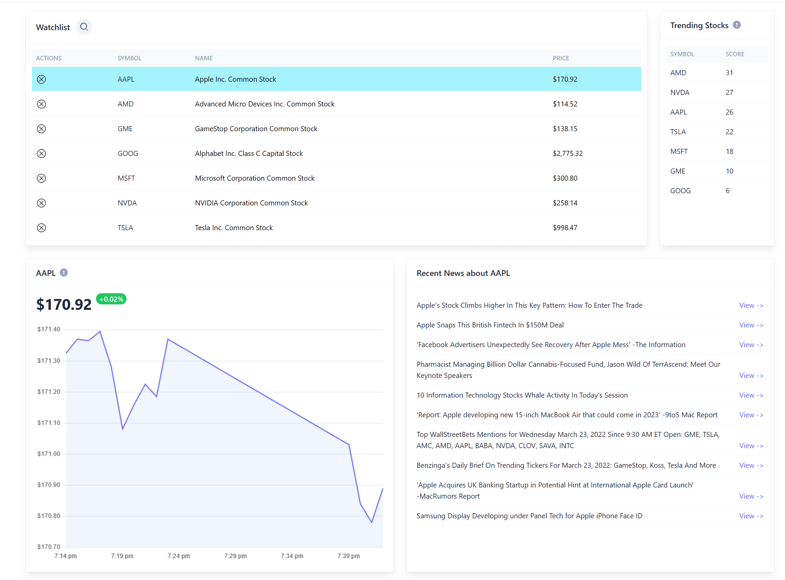

# Introduction




This project demonstrates how you can use Redis Stack to create a real-time stock watchlist application. It uses several different features of Redis:

- Sets
- Pub/Sub
- Hashes
- RedisTimeSeries
- RedisBloom
- RedisJSON
- RediSearch

# Usage with Docker

## Requirements

1. Install Docker

Set the following environment variables in a .env file in the root directory of the project:

1. `APCA_API_KEY_ID`: Your Alpaca API Key found on the Alpaca dashboard
1. `APCA_API_SECRET_KEY`: Your Alpaca API Secret found on the Alpaca dashboard

## Installation

```
$ docker-compose --env-file ./.env up -d
```

After the containers are up and running (for the first time), go into the `data` directory and run:

```
$ pip install -r requirements.txt
$ python main.py
```

# Usage Locally

## Requirements

1. python 3.6+
1. pip

## Environment Variables

Create a `.env` file in the root directory of the project and set the following environment variables:

```
APCA_API_KEY_ID=<your-api-key>
APCA_API_SECRET_KEY=<your-api-secret>
REDIS_URL=<redis-url>
REDIS_OM_URL=<redis-url>
```

Create a `.env` file in the `ui` directory of the project and set the following envionrment variables:

```
NEXT_PUBLIC_API_URL=http://localhost:8000/api/1.0
NEXT_PUBLIC_WS_URL=ws://localhost:8000
```

## Installation

From the root directory, run the following commands:

```
$ python -m venv ./.venv
```

### Stream Service

Run the following commands in the `stream` directory:

```
$ pip install -r requirements.txt
$ python main.py
```

### API Service

Run the following commands in the `api` directory:

```
$ pip install -r requirements.txt
$ uvicorn main:app
```

### Web Service

Run the following commands in the `web` directory:

```
$ npm install
$ npm run dev
```

# Known Issues

1. There is a known issue with the Alpaca websocket API thread safety. You will find a workaround in the alpaca.py file.

# Managed Hosting

Redis offers [managed hosting for Redis Stack](https://redis.info/3tyWUYJ) for free, and you can even get $200 in credits towards a paid subscription by using code TIGER200.
